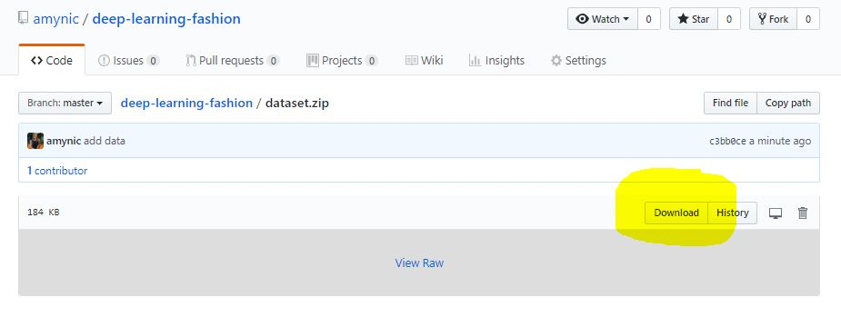
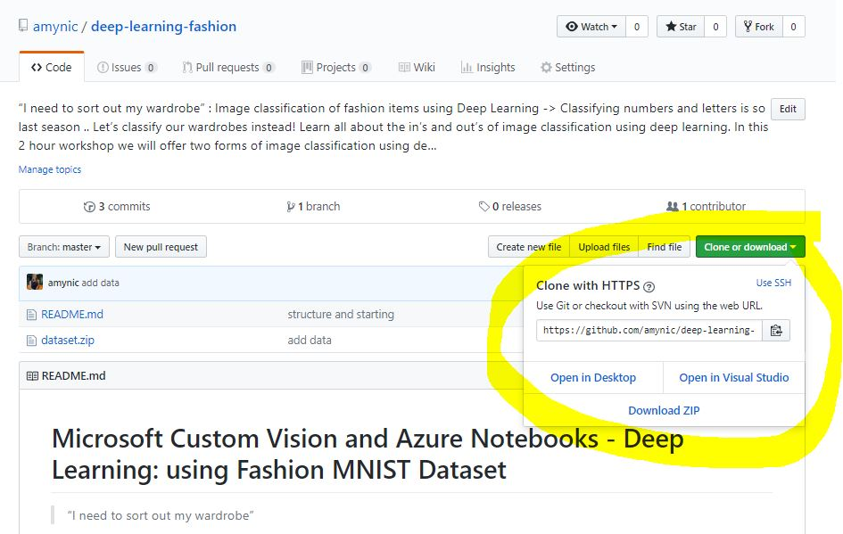

# Microsoft Custom Vision and Azure Notebooks - Deep Learning: using Fashion MNIST Dataset

> “I need to sort out my wardrobe” 

*Image classification of fashion items using Deep Learning* - Classifying numbers and letters is so last season .. Let’s classify our wardrobes instead! Learn all about the in’s and out’s of image classification using deep learning. 

In this 2 hour workshop we will offer two forms of image classification using deep learning. One will be using the Microsoft Custom Vision service and transfer learning, and the other will be using the Microsoft Azure Notebooks and the deep learning API, Keras. 

Both exercises will show you, step-by-step, how to classify clothing into categories such as dresses, t-shirts, sandals, trainers etc. The dataset we will use will be the Fashion MNIST dataset from Zalando the online fashion brand: https://github.com/zalandoresearch/fashion-mnist 

## Pre-requisities

* Bring your laptop
* Have access to a modern web browser (Microsoft Edge, Google Chrome, Firefox etc)
* Have access to a Microsoft account (outlook.com, Hotmail.com etc) or sign up here: http://signup.live.com/ 
* Experience with coding, we will be using the Python Language

## Microsoft Custom Vision and Azure Notebooks for Image Classification

1. Download and unzip the 'dataset.zip' file from GitHub *(should take around 10 secs)*. 
    * Select the dataset folder and choose the download button
    
    * Or download the whole repository from the Readme page
    

## Microsoft Data Science Virtual Machine for Deep Learning

