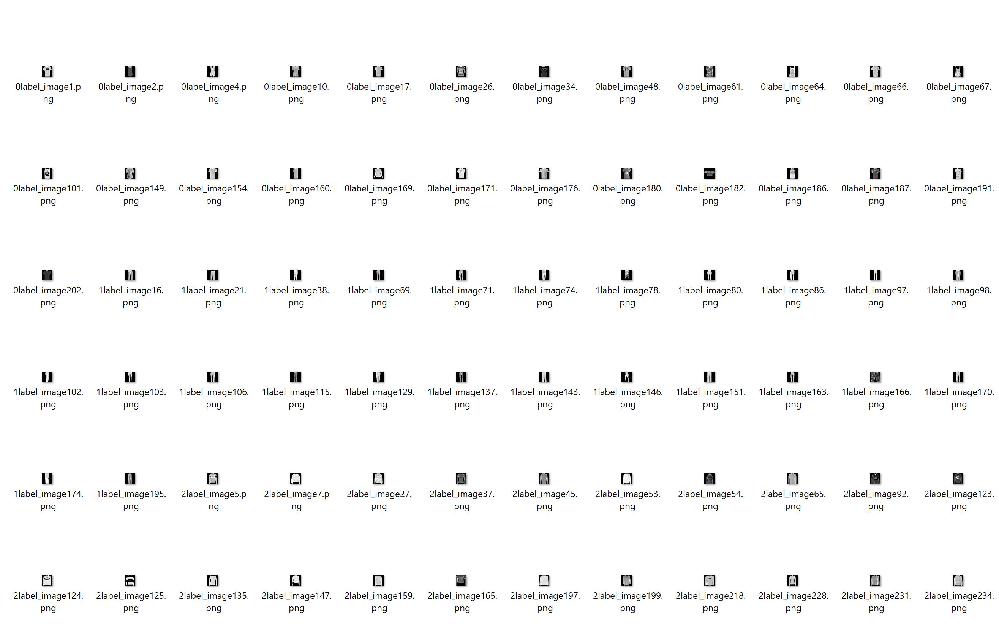
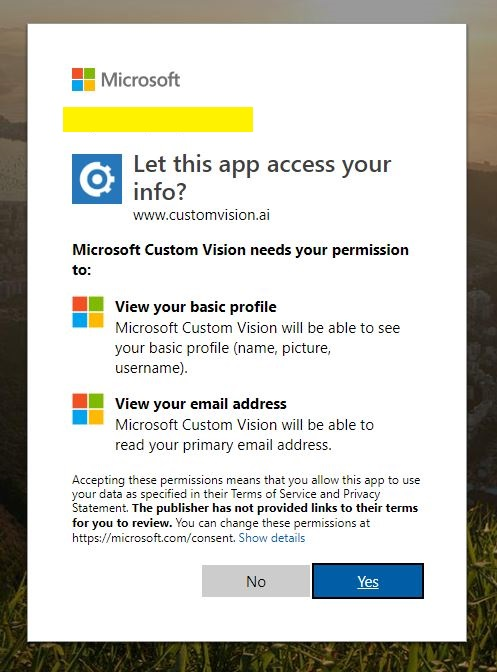
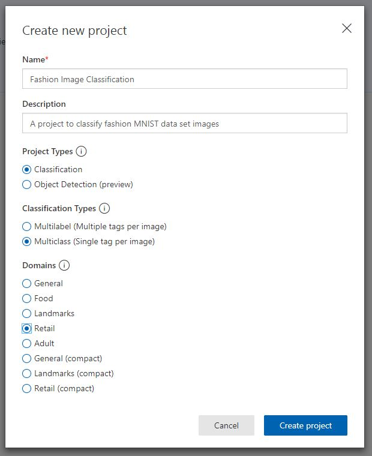
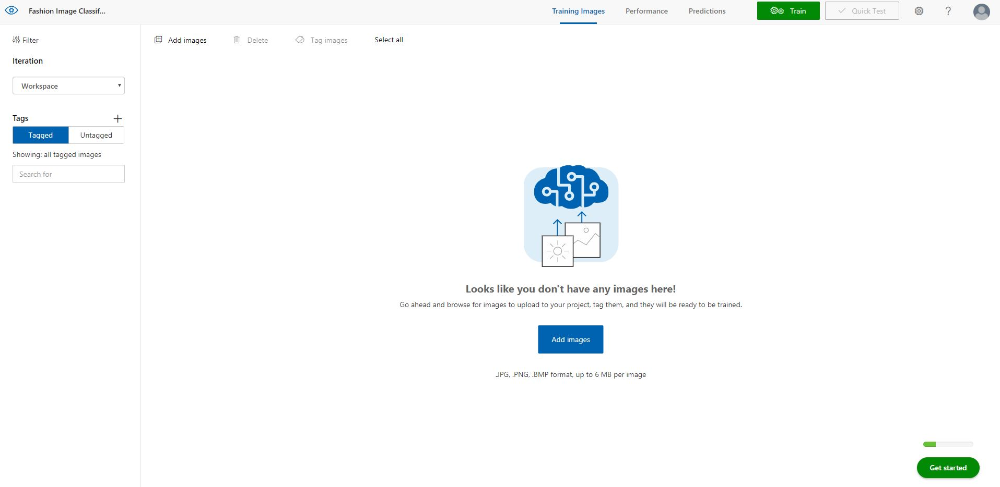
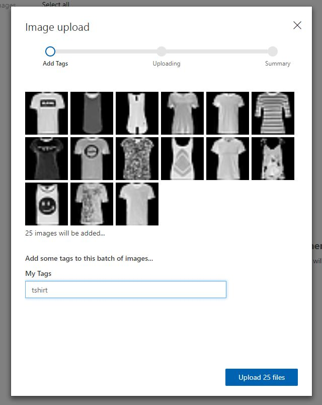
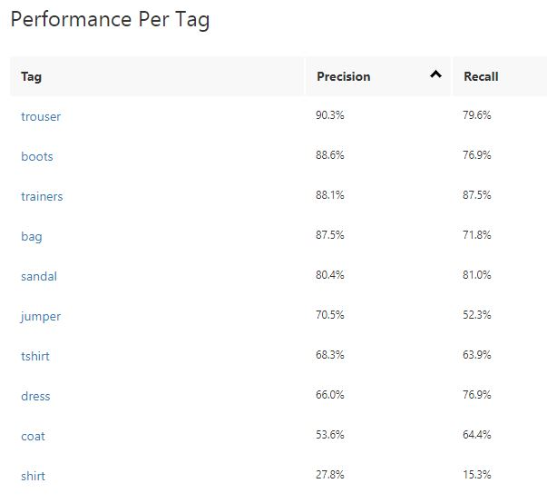

# Microsoft Custom Vision and Azure Notebooks - Deep Learning: using Fashion MNIST Dataset

> “I need to sort out my wardrobe” 

*Image classification of fashion items using Deep Learning* - Classifying numbers and letters is so last season .. Let’s classify our wardrobes instead! Learn all about the in’s and out’s of image classification using deep learning. 

In this 2 hour workshop we will offer two forms of image classification using deep learning. One will be using the Microsoft Custom Vision service and transfer learning, and the other will be using the Microsoft Azure Notebooks and the deep learning API, Keras. 

Both exercises will show you, step-by-step, how to classify clothing into categories such as dresses, t-shirts, sandals, trainers etc. The dataset we will use will be the Fashion MNIST dataset from Zalando the online fashion brand: https://github.com/zalandoresearch/fashion-mnist 

## Pre-requisities

* Bring your laptop
* Have access to a modern web browser (Microsoft Edge, Google Chrome, Firefox etc)
* Have access to a Microsoft account (outlook.com, Hotmail.com etc) or sign up here: http://signup.live.com/ 
* Experience with coding, we will be using the Python Language

## Microsoft Custom Vision and Azure Notebooks for Image Classification

1. Download and unzip the 'dataset.zip' file from GitHub *(should take around 10 secs)*. 
    * Select the dataset folder and choose the download button
    
    * Or download the whole repository from the Readme page
    
    * This contains two folders: train and test data. Look in the folder and view the images
    
2. Visit [www.customvision.ai](http://www.customvision.ai/) and click 'Sign In'
    * Enter your Microsoft Account email and password
    * accept the permissions ask window
    
    * Continue with the trial account
    
    * now you should see a portal like below
    

3. Create a new project
    * Select new project and complete the fields as shown below
    
        * Name: name of project
        * Description: description of project
        * Project Types: Classification
        * Classification Types: Multiclass (single tag per image)
        * Domains: Retail
    * Finally click create project and you should see the below
    
 
4. Now lets add training images and classes to our model
    * Click Add Images in the top left
    
    * From the 'train' folder of images, every image is prefixed with a label number. For example: 0label_image1.png - this means label/class/category 0 and image 1. There are 0-9 classes for this model and 25 training images per class. Select all the images for class 0 and choose open
    
    * On the upload screen, review the images and in the 'My Tags' box type 'tshirt' and hit enter.
    * Once the 'tshirt' tag turns blue, select 'upload 25 files'
    
    * Now you should see your images added to the environment for one class which is labelled on the left
    

5. Now complete Step 4 for the other 9 classes. Find below the corresponding label number to label text:

| Label Number      | Label Text  |
| ------------- |:-------------:|
| 0      | tshirt |
| 1      | trouser |
| 2      | jumper |
| 3      | dress |
| 4      | coat |
| 5      | sandal |
| 6      | shirt |
| 7      | trainers |
| 8      | bag |
| 9      | boots |

* Select images from each category to upload
* Add the correct tag to each class
* Complete this for classes 0-9

6. Once all images are uploaded you are ready to train the model. In the top right corner click 'Train'

7. After training you will be take to the 'Performance' tab where you will see summary statistics of the trained model you created - its not too bad!

    * You can also review the performance metrics by category
    

8. Now to test the model on new images
    * We can test the model quickly in the UI.
    * In the top right click 'Quick Test'
    
    * choose browse for files and select an image from the 'test' folder. Click open and view the models evaluation of this image.
    
    

These images are 28 x 28 pixel images and so are very small. Therefore we will try another way of testing the model using an Azure Notebook.

Notebook editors are often using in Machine Learning.

## Microsoft Data Science Virtual Machine for Deep Learning

